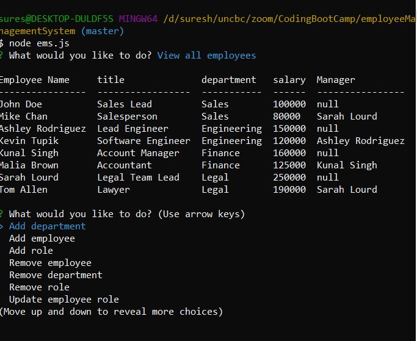

# employeeManagementSystem

[Employee Management System walkthru video](https://youtu.be/KULWAx7tqAo)

#### App In Action

## Table of Contents

- [Description](#Description)

- [Installation](#Installation)

- [Instructions](#Instructions)

- [License](#License)

- [Contributing](#Contributing)

- [Tests](#Tests)

- [Questions](#Questions)

## Description

This is a backend command line app that uses nodejs, mysql, inquirer and console.table. This app manages a company's employees. This app is designed based on the following . It allows the users to

- Add departments, roles, employees

- View departments, roles, employees

- Update employee roles

Also the app has some high end features such as

- Update employee managers

- View employees by manager

- Delete departments, roles, and employees

- View the total utilized budget of a department -- ie the combined salaries of all employees in that department

## Installation

You need mysql, console.table, inquirer packages installed for this app to run. So the steps are :

1. Clone this [repository](https://github.com/s-suresh-kumar/employeeManagementSystem)
2. Issue `npm i` at your local repository root, so that all dependencies are installed.
3. Launch the app at the root of the repository 'node ems.js'. The in command line you will be given options to view employees, roles, departments, delete the same , update certain fields etc.,

## Instructions

Since this is a command line app, the app needs to be installed following above instructions. Then launch the app using CLI command node ems.js at the root of the local repository. Then navigate using up / down arrow keys to select the action you want the app to perform and see the results. To quit the app, choose Exit option in the CLI.

## License

This project is licensed under the [MIT](https://opensource.org/licenses/MIT) License.

## Contributing

When contributing to this repository, please first discuss the change you wish to make via issue, email, or any other method with the owners of this repository before making a change.

Please note we have a code of conduct, please follow it in all your interactions with the project.

### Pull Request Process

Ensure any install or build dependencies are removed before the end of the layer when doing a build.
Update the README.md with details of changes to the interface, this includes new environment variables, exposed ports, useful file locations and container parameters.
Increase the version numbers in any examples files and the README.md to the new version that this Pull Request would represent. The versioning scheme we use is SemVer.
You may merge the Pull Request in once you have the sign-off of two other developers, or if you do not have permission to do that, you may request the second reviewer to merge it for you.

### Code of Conduct

#### Our Pledge

In the interest of fostering an open and welcoming environment, we as contributors and maintainers pledge to making participation in our project and our community a harassment-free experience for everyone, regardless of age, body size, disability, ethnicity, gender identity and expression, level of experience, nationality, personal appearance, race, religion, or sexual identity and orientation.

#### Our Standards

Examples of behavior that contributes to creating a positive environment include:

Using welcoming and inclusive language
Being respectful of differing viewpoints and experiences
Gracefully accepting constructive criticism
Focusing on what is best for the community
Showing empathy towards other community members
Examples of unacceptable behavior by participants include:

The use of sexualized language or imagery and unwelcome sexual attention or advances
Trolling, insulting/derogatory comments, and personal or political attacks
Public or private harassment
Publishing others' private information, such as a physical or electronic address, without explicit permission
Other conduct which could reasonably be considered inappropriate in a professional setting

#### Our Responsibilities

Project maintainers are responsible for clarifying the standards of acceptable behavior and are expected to take appropriate and fair corrective action in response to any instances of unacceptable behavior.

Project maintainers have the right and responsibility to remove, edit, or reject comments, commits, code, wiki edits, issues, and other contributions that are not aligned to this Code of Conduct, or to ban temporarily or permanently any contributor for other behaviors that they deem inappropriate, threatening, offensive, or harmful.

#### Scope

This Code of Conduct applies both within project spaces and in public spaces when an individual is representing the project or its community. Examples of representing a project or community include using an official project e-mail address, posting via an official social media account, or acting as an appointed representative at an online or offline event. Representation of a project may be further defined and clarified by project maintainers.

#### Enforcement

Instances of abusive, harassing, or otherwise unacceptable behavior may be reported by contacting the project team at [suresh01@yahoo.com]. All complaints will be reviewed and investigated and will result in a response that is deemed necessary and appropriate to the circumstances. The project team is obligated to maintain confidentiality with regard to the reporter of an incident. Further details of specific enforcement policies may be posted separately.

Project maintainers who do not follow or enforce the Code of Conduct in good faith may face temporary or permanent repercussions as determined by other members of the project's leadership.

#### Attribution

This Code of Conduct is adapted from the Contributor Covenant, version 1.4, available at http://contributor-covenant.org/version/1/4

## Tests

There are no automated tests written for this app. However it is easy to launch the app by issuing 'node ems.js' at the root of the local repository. It is easy to view, delete and create employee, role, manager etc., easily by following instructions above. All modified dat is persisted since they are stored in mysql database.

## Questions

Please send your questions via e-mail or via my github profile.

https://github.com/s-suresh-kumar
suresh01@yahoo.com
